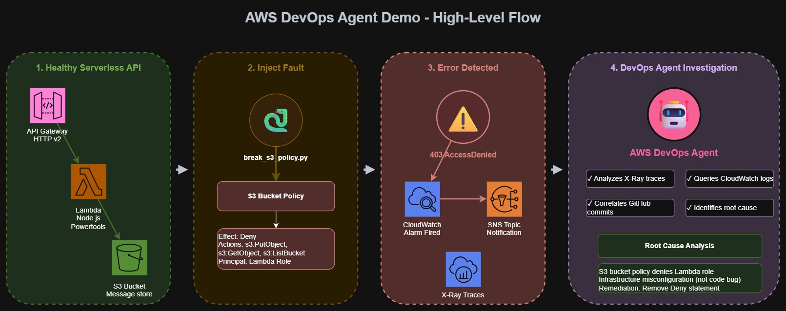
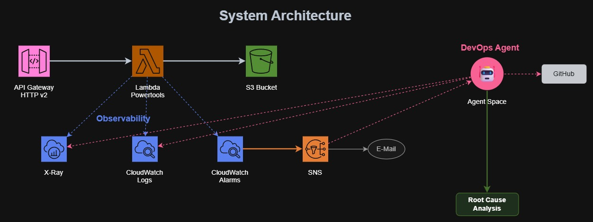
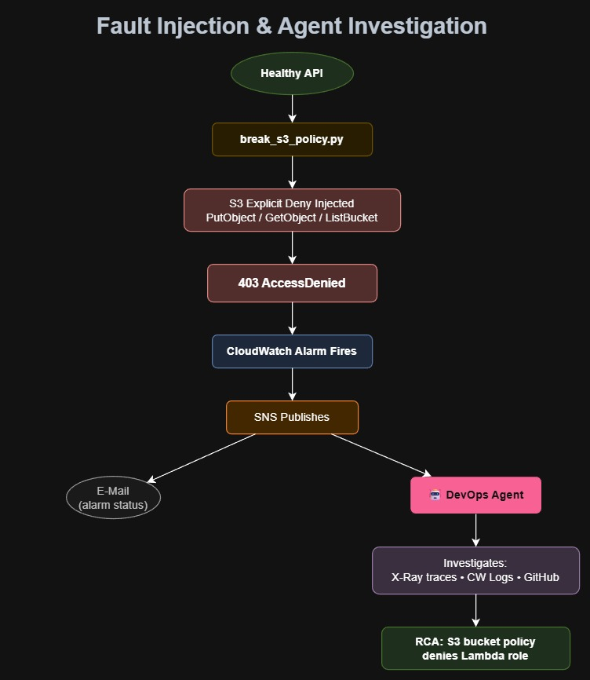

# AWS DevOps Agent Demo

Serverless message API that demonstrates **AWS DevOps Agent** autonomously diagnosing infrastructure faults via X-Ray traces and CloudWatch logs.

---

## What This Demo Shows

A healthy serverless API (API Gateway → Lambda → S3) is deliberately broken via S3 bucket policy injection. AWS DevOps Agent autonomously:

1. Detects the incident (CloudWatch alarm)
2. Correlates X-Ray traces, CloudWatch logs, and GitHub commits
3. Identifies S3 bucket policy as root cause (not code)
4. Produces actionable remediation steps

**Key Insight:** Agent differentiates between **code bugs** and **infrastructure misconfigurations**.

---

## Demo Flow

A healthy serverless API is deliberately broken, and the DevOps Agent autonomously investigates the incident to produce a root-cause analysis.



---

## Architecture



### Fault Injection & Agent Investigation



---

## Tech Stack

- **Lambda:** TypeScript, esbuild, AWS SDK v3, Powertools Tracer
- **IaC:** Terraform (AWS provider ~6.0, modular structure)
- **Observability:** X-Ray, CloudWatch Alarms, SNS
- **Fault Injection:** Python 3.12 (boto3)
- **CI/CD:** GitHub Actions (OIDC auth)

---

## Quick Start

### 1. Prerequisites

- **AWS Account** with Lambda, API Gateway, S3, CloudWatch, X-Ray, SNS, IAM permissions
- **[AWS DevOps Agent](https://aws.amazon.com/devops-agent/)** preview access (us-east-1)
- **S3 state bucket** (globally unique, versioning enabled, SSE-S3) in `us-east-1`
- **GitHub OIDC provider** configured ([guide](https://docs.github.com/en/actions/how-tos/secure-your-work/security-harden-deployments/oidc-in-aws))
- **GitHub Actions secrets/variables:**
  - Secret: `AWS_ROLE_ARN`
  - Variables: `AWS_REGION`, `ALERT_EMAIL`, `TF_STATE_BUCKET`

### 2. Deploy

Run the GitHub Actions workflow (manual trigger):

**Actions → Deploy → Run workflow**
- Builds Lambda
- Deploys all modules in a single run: API Gateway + Lambda + S3 + CloudWatch alarms + SNS
- (All modules share one Terraform state, so a unified workflow prevents source_code_hash mismatches)

Save outputs from workflow logs:
- `api_url` — API Gateway endpoint
- `lambda_function_name` — Lambda function name
- `lambda_role_arn` — Lambda IAM role ARN (for fault injection)
- `s3_bucket_id` — S3 bucket name (for fault injection)
- `sns_topic_arn` — SNS topic ARN
- `error_alarm_arn` — CloudWatch error alarm ARN
- `duration_alarm_arn` — CloudWatch duration alarm ARN

### 3. Smoke Test

Run the smoke test to validate the API is healthy:

```bash
bash scripts/smoke-test.sh https://YOUR_API_URL/dev
```

Or trigger via **Actions → Smoke Test → Run workflow** (provide `api_url`).

### 4. Configure DevOps Agent

1. Open [DevOps Agent Console](https://console.aws.amazon.com/devops-agent/home?region=us-east-1)
2. Create/select **Agent Space**
3. Connect your AWS account — auto-discovers AWS resources (Lambda, SNS, S3, CloudWatch, X-Ray)
4. **(Recommended) Connect Slack** — to receive automated notifications of investigation results ([capabilities guide](https://docs.aws.amazon.com/devopsagent/latest/userguide/configuring-capabilities-for-aws-devops-agent.html))
   - Without Slack/ServiceNow: must manually check Agent Space UI for RCA findings
   - Email/SNS don't support investigation result notifications (only alarm status)
5. (Optional) Connect GitHub repository (for change correlation)

### 5. Inject Fault & Observe

1. **Actions → Inject Fault → Run workflow** (provide `bucket_name`, `lambda_role_arn`)
2. Trigger error: `curl -X POST https://YOUR_API_URL/dev/messages -d '{"message":"test"}'` or via smoke test.
3. Monitor:
   - CloudWatch alarm fires (~60s)
   - Email notification received (alarm status only, not RCA findings)
   - X-Ray shows `AccessDenied` errors
4. Check **Agent Space** for RCA

**Note:** SNS email only notifies about alarm status. For **automated RCA notifications**, configure Slack or ServiceNow integration in Agent Space. Otherwise, manually check Agent Space UI for investigation findings.

### 7. Teardown

**Actions → Destroy All Infrastructure → Run workflow**

---

## Documentation

- **[Architecture Guide](docs/architecture.md)** - Technical deep-dive with ASCII diagrams
- **[Demo Runbook](docs/demo-guide.md)** - Step-by-step instructions
- **[DevOps Agent Overview](docs/aws-devops-agent-overview.md)** - Service capabilities

---

## Project Structure

```
aws-devops-agent/
├── .github/workflows/
│   ├── deploy-app.yml              # Build Lambda + Terraform apply
│   ├── smoke-test.yml              # Smoke test API endpoints
│   ├── destroy-all.yml             # Terraform destroy
│   └── inject-fault.yml            # S3 policy fault injection
├── backend/functions/handle_messages/
│   ├── src/index.ts                # Lambda handler (TypeScript)
│   ├── build.js                    # esbuild config
│   ├── package.json
│   └── tsconfig.json
├── terraform/
│   ├── main.tf                     # Root module wiring
│   ├── variables.tf / outputs.tf   # Root inputs/outputs
│   ├── backend.tf / providers.tf   # State & provider config
│   ├── global_tags.tf              # Default resource tags
│   └── modules/
│       ├── app_stack/              # API Gateway + Lambda + S3
│       ├── notification/           # SNS topic + email subscription
│       └── observability/          # CloudWatch alarms + log metric filters
├── scripts/
│   ├── smoke-test.sh               # Smoke test API endpoints
│   ├── break_s3_policy.py          # Inject fault: deny S3 access
│   └── restore_s3_policy.py        # Restore S3 access
└── docs/
    ├── architecture.md             # Technical deep-dive
    ├── demo-guide.md               # Step-by-step runbook
    ├── aws-devops-agent-overview.md
    ├── github-actions-setup.md
    ├── assets/                     # Exported diagram images (JPG)
    └── diagrams/                   # Editable draw.io source files
```

See [Architecture Guide](docs/architecture.md) for detailed component breakdown.

---

## Success Criteria

| # | Criterion | Verification |
|---|-----------|--------------|
| 1 | API returns `200` on GET/POST | `curl` test |
| 2 | X-Ray traces show custom subsegments | X-Ray console |
| 3 | CloudWatch alarm fires on fault | CloudWatch console |
| 4 | Email notification received | Inbox |
| 5 | Agent produces RCA | Agent Space UI |
| 6 | Agent identifies bucket policy as root cause | RCA content |

---

## Tags

All resources tagged via Terraform `default_tags`:

| Tag | Value | Purpose |
|-----|-------|---------|
| `Project` | `DevOpsAgentDemo` | Cost tracking |
| `Terraform` | `true` | IaC-managed |
| `Environment` | `dev` | Environment label |

---

## Repository

**GitHub:** [nirgluzman/aws-devops-agent](https://github.com/nirgluzman/aws-devops-agent)

**License:** Demonstration purposes only
